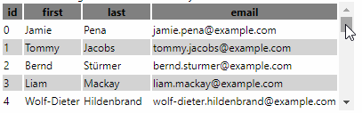

# react-table-scrollbar
React fixed table header position and auto scrollbar.




# Getting Started
[](https://npmjs.org/package/react-table-scrollbar)
* Install the package dependency:
    ```shell
      $ npm install --save react-table-scrollbar
    ```
* Import the `TableScrollbar` component and use it to enclose your table:
    ```javascript
      import TableScrollbar from 'react-table-scrollbar';
      ...
      <TableScrollbar>
        <table>
          ...
        </table>
      </TableScrollbar>
    ```
## Sizing the table
* You can specify the table height as a number of body rows:
    ```javascript
      <TableScrollbar rows={5}>
        <table>
          ...
        </table>
      </TableScrollbar>
    ```
* ... Or by passing a height prop in any valid CSS unit:
    ```javascript
      <TableScrollbar height="200px">
        <table>
          ...
        </table>
      </TableScrollbar>
    ```
* By default, the table will fill up the container's height
    ```javascript
      <div style={{height: "30vh"}}>
        <TableScrollbar>
          <table>
            ...
          </table>
        </TableScrollbar>
      </div>
    ```
# License
MIT

# Contribute
To submit issues and pull requests:
https://github.com/oelshocht/react-table-scrollbar.git
